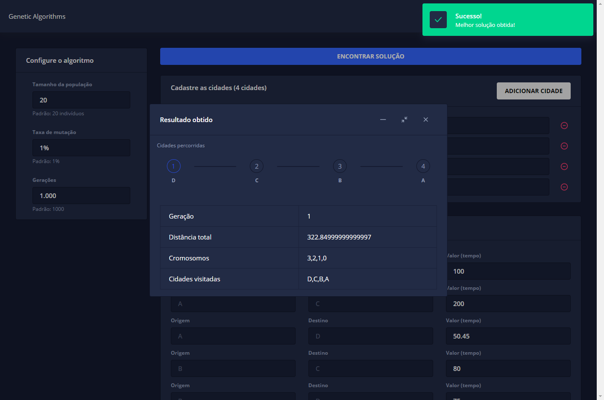

# Algoritmos Genéticos - Problema do Caixeiro Viajante

> [Demonstração](https://caixeiro-viajante.tiagoboeing.com/)

- API: Python
- Frontend: Angular 9



## Critério de parada

O número de gerações é o critério de parada.

| Número de gerações |      |
| ------------------ | ---- |
| Padrão             | 1000 |

## Taxa de mutação

| Taxa de mutação |     |
| --------------- | --- |
| Padrão          | 1%  |

## Tamanho da população

| População |               |
| --------- | ------------- |
| Padrão    | 20 indivíduos |

## Representação dos indivíduos

Cada cidade foi representada pela sua posição no vetor.

Para as cidades: `"A", "B", "C", "D", "E"` teremos um vetor com 5 elementos.

```js
["A", "B", "C", "D", "E"]
[ 0,   1,   2,   3,   4 ]
```

## Representação das distâncias

As distâncias são posicionadas de acordo com a posição do array de cada cidade.

```js
 A   B  C   D   E
[0, 10, 15, 5, 12], // cidade A
[10, 0, 70, 52, 27], // cidade B
[15, 70, 0, 120, 14], // cidade C
[5, 52, 120, 0, 38], // cidade D
[12, 27, 14, 38, 0] // Cidade E
```

## Seleção dos indivíduos

A escolha dos pais de uma população para crossover se deu através do método da **roleta viciada**.

Foi criado um coeficiente para resolver as grandezas inversamente proporcionais (quanto menor a distância que um cromossomo percorre maior será sua probabilidade de ser sorteado)

```text
Coeficiente = 1 /  distância percorrida
Proporção (probabilidade de ser sorteado) = Coeficiente / Soma dos coeficientes
```

Para os cromossomos com custo total de 200 e 148, temos:

|             |             |             | Soma        |
| ----------- | ----------- | ----------- | ----------- |
| Distância   | 200         | 148         | 348         |
| Coeficiente | 0,005       | 0,006756757 | 0,011756757 |
| Proporção   | 0,425287356 | 0,574712644 | 1           |

```python
coeficiente = 1 / 200 # total de 0,005
proporcao = coeficiente / soma_dos_coeficientes
```

```python
# criamos um coeficiente baseado na probabilidade do indivíduo ser selecionado e somamos
for index in range(len(self.population)):
    total_coefficient += (1 / self.population[index].travelled_distance)

# geramos as probabilidades
for i_ in range(len(self.population)):
    coefficient = (1 / self.population[i_].travelled_distance)
    self.population[i_].probability = (coefficient / total_coefficient)
```

"Gira" a roleta

```python
sortedValue = random()  # sorteamos um número da roleta (0 - 1) --> 0% a 100%
while i < len(self.population) and sum < sortedValue:
        sum += self.population[i].probability
        parent += 1
        i += 1
    return parent
```

## Aptidão dos indivíduos (fitness)   

O cálculo do fitness (aptidão) foi realizado com base na soma das distâncias de um indivíduo da população/cromossomo. Na sequência a população é ordenada de forma com que os cromossomos com menor distância fiquem nas primeiras posições do vetor para facilitar a identificação da melhor solução de cada geração. (No caso de seleção com base em torneio esta técnica facilitaria a seleção dos melhores X elementos).

Ex.: `[4, 2, 0, 1, 3]` = 91

> [4, 2, 0, 1, 3] → [E, C, A, B, D]

# API

API em Python disponibilizada publicamente na AWS Lambda.

Definindo indíviduos:

- Tipo: `POST`
- Endpoint: `https://57ngqizuyi.execute-api.us-east-1.amazonaws.com/default`


```json
{
    "populationSize": 20,
    "mutationRate": 1,
    "generations": 1000,
    "cities": [
        "A", "B", "C", "D", "E"
    ],
    "distances": [ 
        [0, 10, 15, 5, 12],
        [10, 0, 70, 52, 27],
        [15, 70, 0, 120, 14],
        [5, 52, 120, 0, 38],
        [12, 27, 14, 38, 0]
    ]
}
```

A resposta será:

```json
{
    "statusCode": 200,
    "body": "{\"generation\": 4, \"travelled_distance\": 113, \"chromosome\": [4, 1, 3, 0, 2], \"cities\": [\"E\", \"B\", \"D\", \"A\", \"C\"]}"
}
```